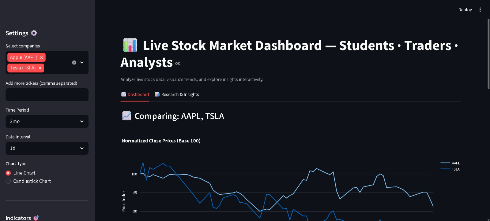
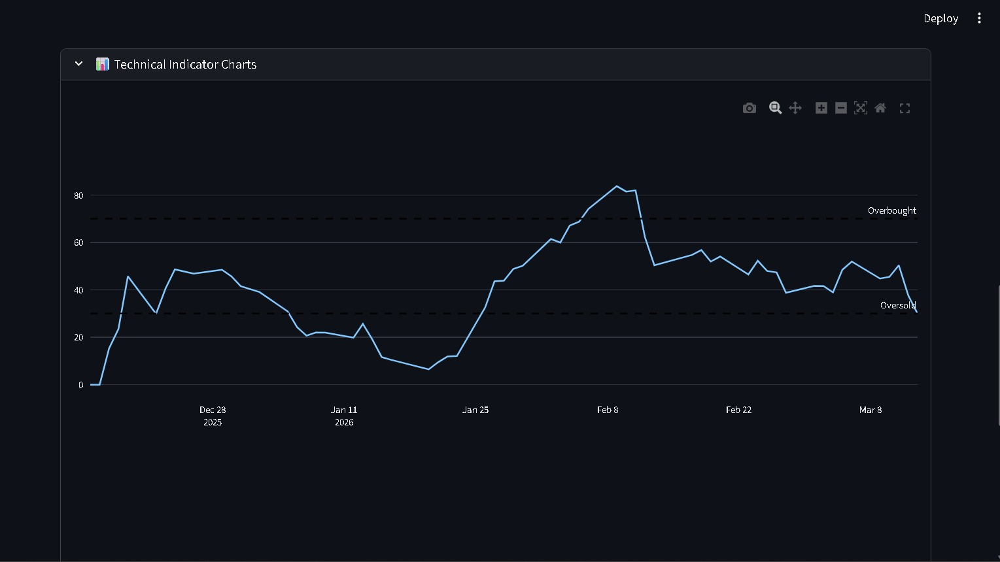
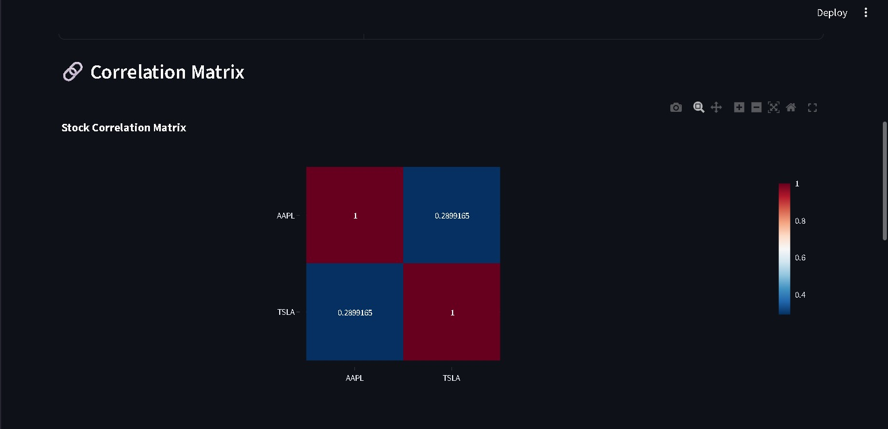
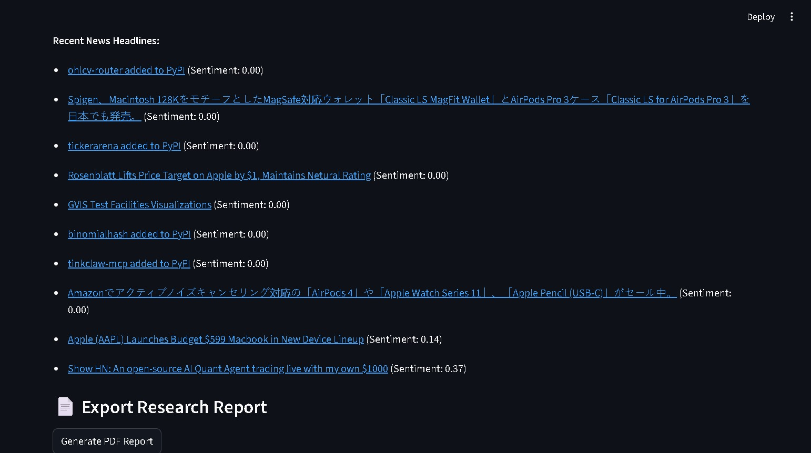

# 📈 Live Stock Market Dashboard

An interactive **Stock Market Analysis Dashboard** built with **Python, Streamlit, and Plotly**.
This dashboard allows users to analyze live stock data, compare companies, and generate insights using technical indicators and sentiment analysis.

---

# 🚀 Features

✔ Compare multiple stocks (AAPL, TSLA etc.)
✔ Interactive stock price visualization
✔ Candlestick and line charts
✔ Technical indicators (SMA, RSI, MACD)
✔ Stock correlation matrix
✔ News sentiment analysis
✔ Export research report (PDF)
✔ Download CSV with indicators

---

## 📷 Dashboard Screenshots

### 📊 Main Dashboard



### 📈 Technical Analysis



### 🔗 Correlation Matrix



### 📰 Sentiment Analysis



### 📉 Sentiment Distribution


# 🛠️ Tech Stack

* Python
* Streamlit
* Pandas
* Plotly
* Yahoo Finance API
* NLP Sentiment Analysis

---

# ⚙️ Installation

Clone repository

```
git clone https://github.com/awschavan/Live-Stock-Market-Dashboard.git
```

Go to project folder

```
cd Live-Stock-Market-Dashboard
```

Install dependencies

```
pip install -r requirements.txt
```

Run the dashboard

```
streamlit run app.py
```

---

# 📊 Use Cases

• Financial data visualization
• Stock market analysis
• Learning technical indicators
• Data analytics portfolio project

---

# 👨‍💻 Author

Swapnil Chavan
Aspiring Data Analyst

GitHub: https://github.com/awschavan

---

⭐ If you like this project, please give it a star!
